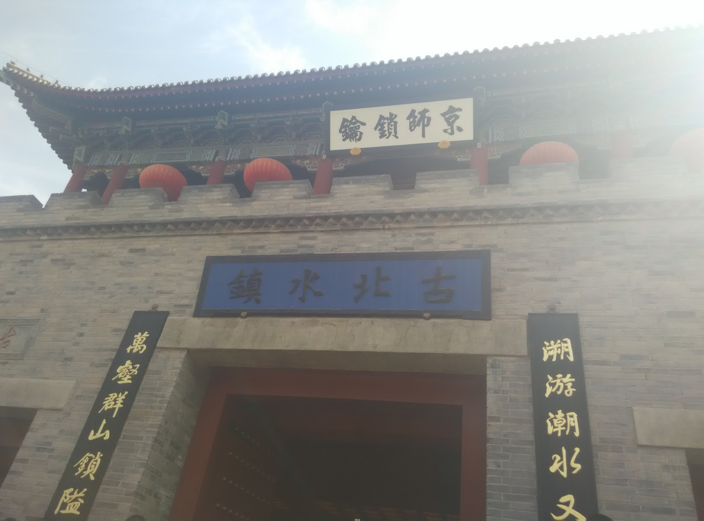
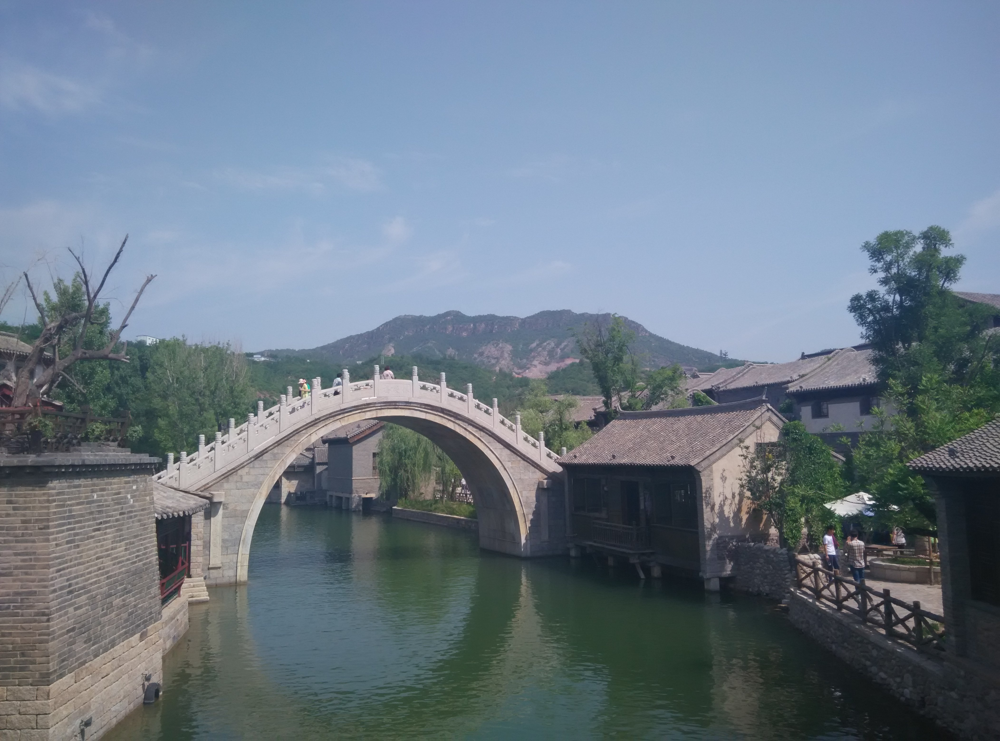
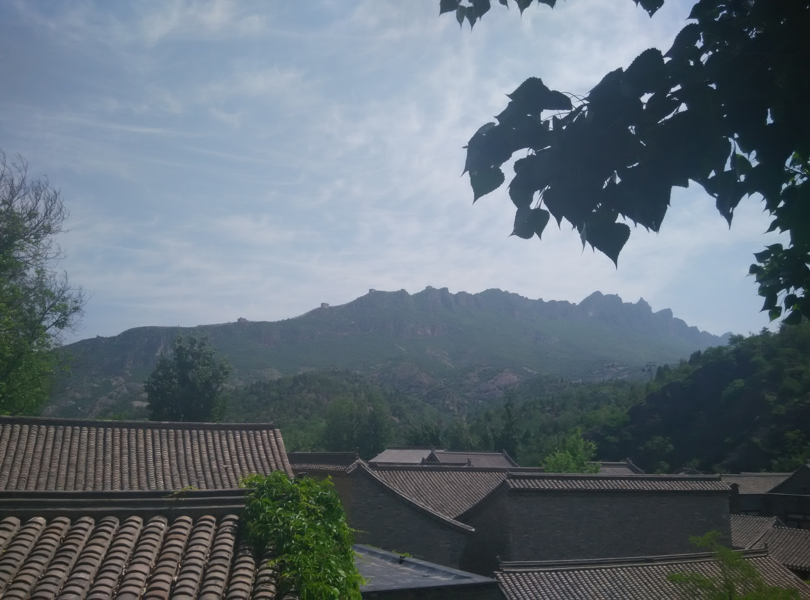
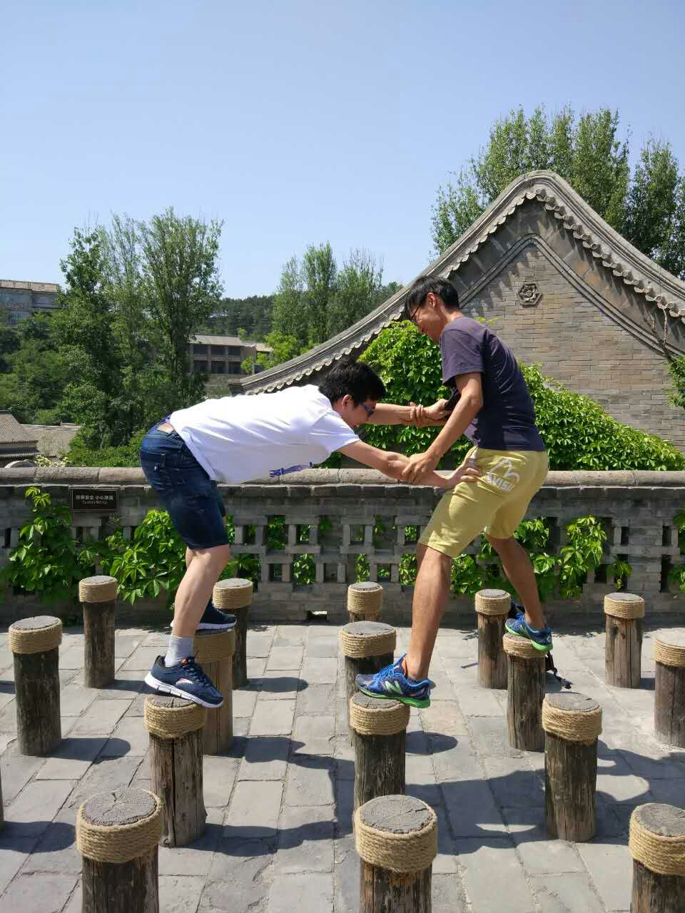
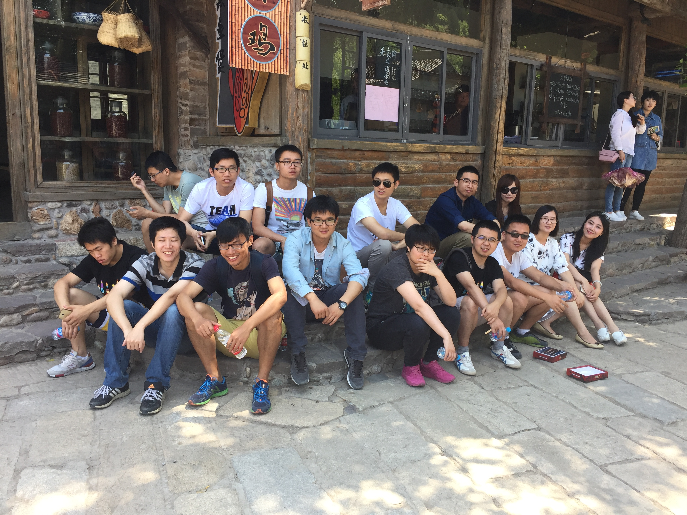

# 201605

yangliang @ 20160529

# 5月

## 工作

重构风控服务，jupiter项目，熟悉drool使用，慢慢熟悉Java开发。

业务

* 风险控制的事中阶段(风控分为事前，事中，事后)，支付风控等
* 对风控业务规则，常用的信息维度有一定认识

技术
 
 * Java做业务开发比C++适合。速度快，框架更完善：多线程编程，高并发
 * 协作开发. git协作，分支管理
 * Drool的使用
 * RPC Dubbo的熟悉: 对Dubbo从源码层面有一个大致的熟悉

## 读书

技术

* Java编程思想: 基础知识，语法大全
* Effective Java: Java进阶
* 图解Http: 熟悉Http协议

杂七杂八

* 京华烟云
* 全球通史

## 其他

* 周末坚持吃早餐
* 每周至少3次的健身
* 古北水镇一游: 北方难得的江南味

  
  
## Some Pic

古北水镇

有点江南的味

夏景也不错

梅花桩

Team

