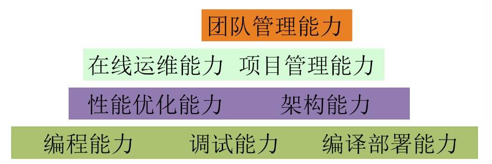

[TOC]

最近脑子里总在想几个词，`复盘`，`沉淀`，`总结`，`思考`。正好看到美团技术博客上的一篇[文章](https://tech.meituan.com/study_vs_work.html)，感觉很对口。摘要同时写写读后感，权当小结。

文章标题《工作中如何做好技术积累》，分为3分方面阐述

* 关于学习的一些方法论
* 一些常见疑惑：良好心态的重要性
* 架构师的能力模型

## 关于学习

* 坚持：基础的理论知识；各种新知识
* 实践：7+2+1模型 for 岗位实践+向他人学习+培训。在实践中成长
* 交流：交流对象多样性；积极参与讨论，暴露自己
* 总结和输出：分享、书写、解答问题等方式
* 规划：长期规划(眼界+运气 for 方向；行业+积累+及时调整)；短期规划(生活+成长+绩效+晋升)

## 常见疑惑

* 学无止境：学习的目的(方向)、方法(分清主次)；快速学习的能力；长时间投入
* 技术高手：以问题和需求为导向，驱动技术，不用沉醉技术
* 做项目 && 职责：深度+独立思考；合理分配精力
* 基础技术 && 业务：关注点不同，无高低之分
* 可行性调研：收益和成本的折中。明确预期；可行方案；所需成本
* 沟通：可靠性 - TCP(我知道你知道)和UDP(希望你知道) 两种模式；时效性 - 同步模式和异步模式 
* 带人之道
* 效率：结果为导向

## 架构师的能力模型

作者对架构师能力的分层总结如上，我稍微整理分类如下

* 技术侧：编程调试；编译部署；性能优化；在线运维
* 业务侧：业务理解及架构
* 管理侧：项目管理；团队管理

### 技术侧

* 编程：本质是翻译业务需求
  * 高质量的代码依靠：面向对象；设计模式
  * 手段：多写/看代码；找人Code Review
* 调试：多写代码；多 Debug
* 编译部署：对开发测试上线环境及流程的熟悉
* [性能优化](https://tech.meituan.com/performance_tunning.html)：CPU、存储、网络、IO 等；结合业务需求
* 在线运维：监控、上报、升级；快速定位问题；实践

### 业务侧

* 有效沟通，减小信息损失，理解需求
* 深入了解真实业务场景，抽象业务
* 架构对业务频繁变更的支持

### 管理侧

* 项目管理
  * 以终为始，项目拆解，确定里程碑
  * 把握关键节点，集中攻坚，先紧后松，及时调整
* 团队管理：规划能力，权衡

