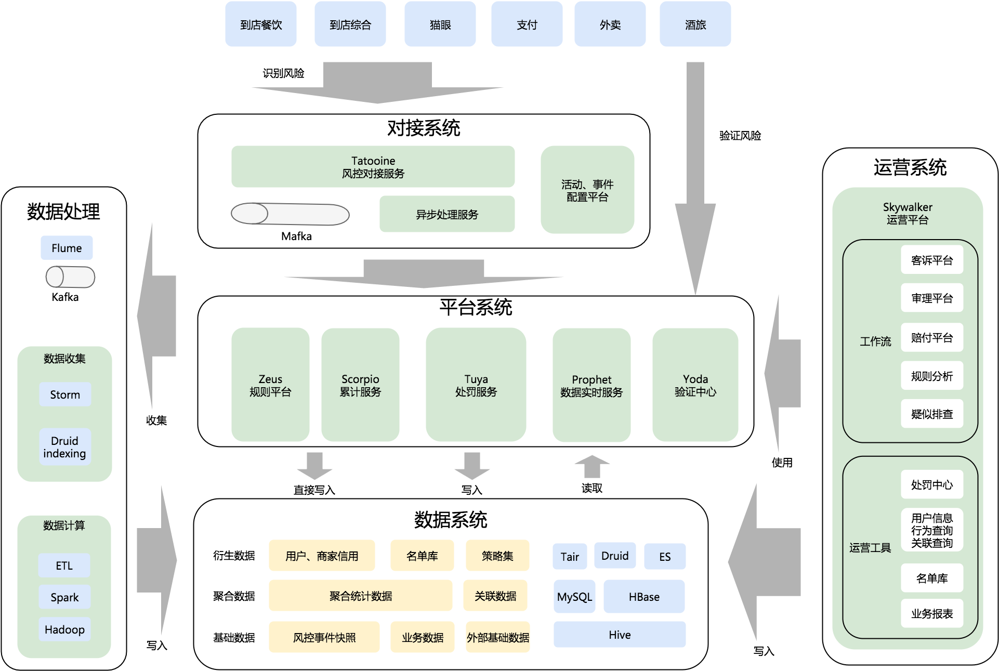

# 写在前面

## 定位

这份README定位是总结个人工作履历，同时也是对自己技能知识的一个总结。

通过总结，来发现自己技能的不足之处，然后补充学习。

## 对工作的理解

平时都是埋头工作，难得有时间安静的思考沉淀自己做事情的方法论。这里写写自己工作这么多年来，当下对工作的一点点思考。

工作都是解决问题，结果导向的。个人理解大致的步骤如下。

### 定义问题

策略算法需要解决的问题

level1 例如提升某个产品线的收入或者用户体验。提升收入无非开源节流，"开源”即是找到新的收入渠道，“节流”可以是提升反作弊能力减少羊毛党在平台上的消耗等

level2 具体点说，例如广告投放，通过策略提升投放的精准度，提升点击率转化率；搜索提升搜索结果相关性，让用户体验更好；风控策略精准识别平台上的风险下单、支付等行为，减少资损等

level3 提高算法策略准确和召回 

工程需要解决的问题

支撑各产品线业务的快速迭代，平衡 迭代开发效率 和 稳定性

TODO 更加具体的问题

### 定义衡量标准

策略算法类：准确和召回的平衡

工程类：迭代开发效率 和 稳定性

### 制定方案

### 执行方案

### 复盘总结

# 一、业务

面临特定业务场景，解决具体的问题。一共经历了 广告、风控、推荐、导购共4个业务场景，其中广告和推荐可归属为一类，类似的还有搜索业务场景。

## 广告

第一份工作的总结，见[这里](https://github.com/yangliang1415/blog/blob/master/temp/first_work.md)

简要介绍了广告业务，需要解决的问题，及涉及到的相关技术点

## 风控

这个有专门起专题总结过，见[这里](https://github.com/yangliang1415/awesome-risk-control)。架构大图如下，源自美团blog。

## 推荐

和广告业务类似，不过这里特定针对短视频的推荐。

## 导购

# 二、工程

## 语言基础

Java 征途，参考[这里]()

## 相关框架

## 基于业务的架构

业务模型；库表设计；业务流程

## 大数据

# 三、算法

基本数据结构和算法，见[这里](https://github.com/yangliang1415/algo)

数据处理相关

常用机器学习算法，见这里

# 四、Soft Skill

向上沟通

拿结果

思考总结写作

学习学习：以问题为导向；实践

# 参考

工作中的学习 https://tech.meituan.com/2018/04/16/study-vs-work.html

# 变更记录

update@20191013@良渚

- 增加 [写在前面] 模块

create@20190928@良渚

* 框架梳理
* 资源整合
* TODO
  * 细化总结各业务知识
  * 工程和算法相关技术知识，分专题总结
  * 配置缓存方案小结，见这里