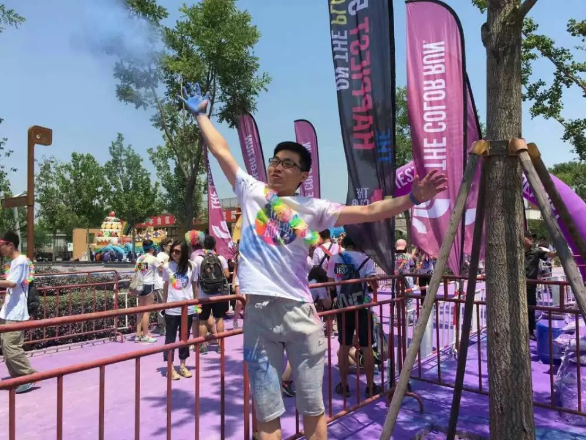

# 201606 

>* yangliang @ 20160616
>* update@ 20160707

关键词: `Java` `Color Run` `健身`  `总结` `两年`

## 工作相关

6月的总结拖至今天，拖延症患者晚期。简单先总结下这个月的工作

* 风控服务的重构Jupiter项目也基本完毕
* Dubbo源码阅读: 对框架流程有大致认识
* 书籍阅读: `Effective Java` `Java编程思想` `深入理解Java虚拟机`

## 个人思考

### 写作
写作是另一种思考，更是一种和自己对话的方式，帮助清除大脑缓存，辅助记忆。希望自己能够坚持。

### 工作
工作两年后的状态和之前明显不同。

* 以前: 总是烦恼不知道该怎么`做好工作`；对各种`技术`有着无限的`热情`、`好奇`，却不知道从何学起，什么场合使用等等，更是`缺乏实践`。`沟通`不是那么顺畅，容易玻璃心
* 现在: 对工作有自己的`认知`，大概知道该干什么，怎么去`规划`(仍需加强)。对技术认知更加理性，慢慢知道`各种框架`，专业点叫懂`技术选型`，这大概是`技术人(架构师)`需要积累的。内心慢慢变得强大(Kill the boy, let the man to be Born)

### 关于技术
随着工作年限的增长，对各种新技术，不再那么热血。更多的是关注为啥有它；它主要解决什么问题；适用场合，自己是否用得着；设计思想理念等等。

语言框架细节，也还是需要自己慢慢积累，除了实践还是实践。各种语言框架的优缺。

## 生活其他

北京的蓝天

一起high起来～

😄

和歪果小盆友的合影

