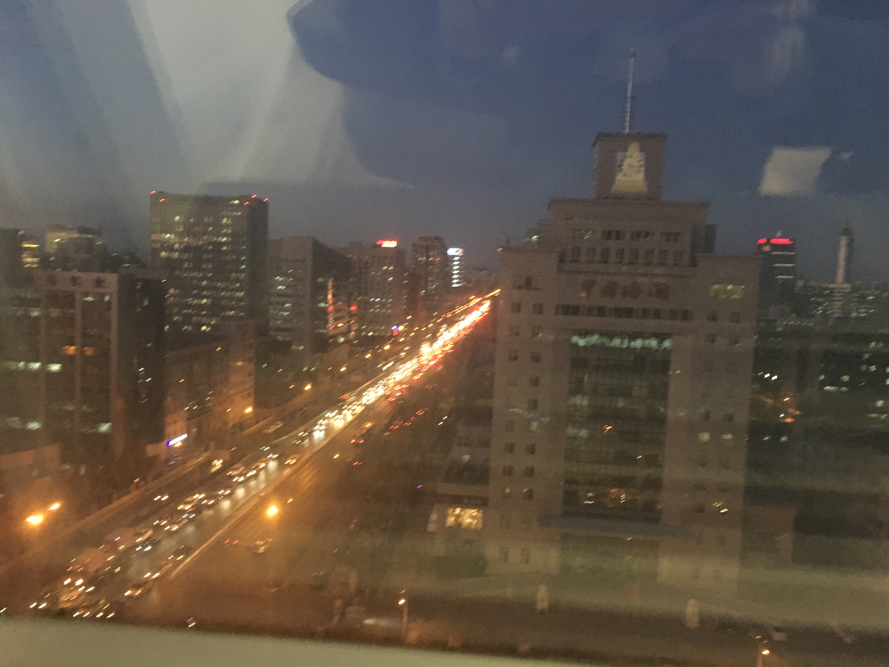

> @20171207
>
> @健德門

2017，真是“動蕩”的一年。當然，這是相對16年來講的。感覺工作以來，16年是過得相對最開心的一年。或許工作不僅僅是技術的學習、業務指標的實現，和身邊的環境、氛圍也有關係吧。

當然，今天的主題不是對比2017和2016，僅僅是想梳理梳理過去的近一年的時光，以及接下來的打算。工作也好，生活也是。寫下這些文字前，還特意翻看了下自己以前的每月小結，發現2017空白了不少。

在2017剛開始時，大致也預料到了今年自己會換工作，所以也很大部分時間都圍繞著換工作這個主題。

中間。從5月份準備簡歷，6、7月份找工作，8、9月份交接工作、入職等。也算是消耗了不少時間在切換，包括個人狀態，環境適應等，這大概也就去了半年時間了。

往前。1、2月份春節、三亞年會、杭州之行，都是難得的經歷。3到5月份去了深圳2趟，感覺那時自己好能折騰。

往後。就是在 TX 的3個月了。其中十一回家老弟定親算是一件大事了。

努力回憶，流水賬一般寫下2017的經歷，是為以後回憶留下些什麼吧。

其實，我想寫的，更多的是對自己的反思，對以後的規劃。

有反思，大致是認識和意識到自己的問題了，這也是解決問題的第一步吧。所以我的問題是？：

* 對未知事情的國度不自信，太過謹慎
* 容易急躁，想得太多

這些問題，是在我換工作三個月中適應、調整中深刻感受到的。這些問題的解決，我覺得需要自己直面自己，以後遇到問題，不要輕易退縮。只有不斷建設這種正反饋，才能擁有強大的內心，於是正向循環。

三言兩語，總感覺說不清那個點。“實踐是檢驗真理的唯一標準”，感覺這句話放在這裡，似乎能 say sth。

就此打住。

憧憬下2018吧，just around the corner。

工作

兜兜轉轉，又回到算法的坑。需要更多的思考和強大的實踐執行。放開手去做。

能在算法方向有個原始積累，基本的幾個方面

* 離線「重心」：大數據處理；模型算法能力；業務理解
* 在線「輔助」：服務工程

生活

健康的體魄。

身體、靈魂。

讀讀雜書，鍛煉身體。

在家

办公新大楼夜景

