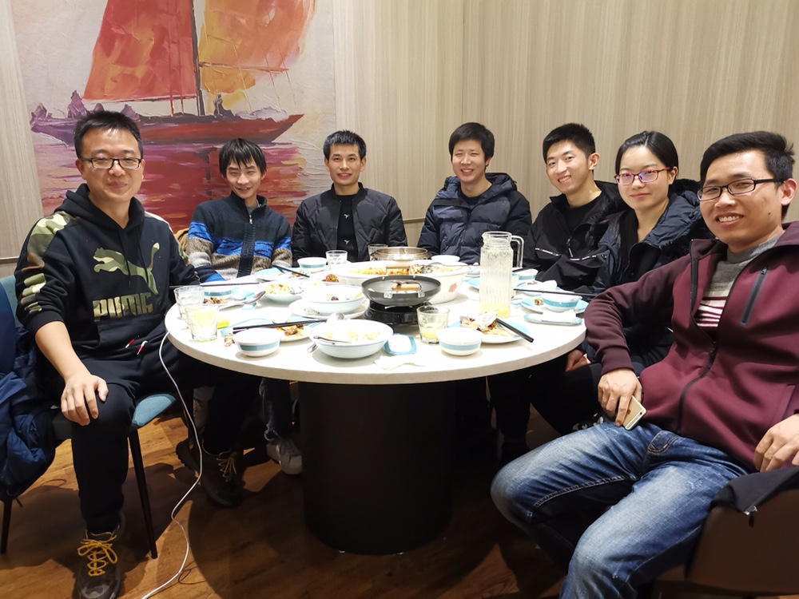

春节后的日子，年味渐淡，日复一日的重复着。

翻翻豆瓣日记，上一篇还是18年5月刚回杭州那会。大概是很多琐碎都写在微博或者手机便条上了。好久没清清脑子，怕是微博的字数不够用了，手机扣字也慢，于是就有了这篇日记。

其实今天最想写的是2个人的对比。1个是全家卖早餐的那个小姐姐；1个是晚餐公司食堂卖炸酱面的大爷。对比的鲜明，才让人有所察觉和思考。

卖早餐的小姐姐。每天红彤彤的脸颊，不是那种害羞的红，是那种皮肤过敏似的红。她面对着玩手机买早餐排着长长队伍的我们，似乎总是不高兴的样子，重复着"下面同学要什么"。她的不高兴写在了她脸上和不耐烦的语气中，倒是也能理解。不过我从来不气她，每每轮到我，总是能准确快速的说出“鲜肉包子，酸菜包子各一个，一杯豆浆”，尽管有时我还带着耳机。结账我都记住了价格，组合优惠价8元，很少卡壳在我这。

卖炸酱面的大爷。比较有意思，每到他那打面条，都说小伙子吃点啥，要什么酱。虽然吃多了都很清楚，有时候也还是故意问一下，能加几种呀，这是啥，那是啥。而他回答总是吆喝着，好嘞好嘞。充满了乐趣的样子。甚至同事都私下嘀咕，这大爷咋看着总这么高兴呢。

同样是不那么“有趣”的工作，他俩的表现对比的太过鲜明。而自己最近工作也不是那么shun。似乎能给人启迪。

自我调节。积极主动。苦中作乐

----------分割下

今天北京的同事过来开年会。而我还在公司走不开，约到公司附近吃了个饭，发现自己比以前健谈多了。可能是因为跟他们相处那会，自己是开心的，也成长了很多，放得开的缘故吧。说是同事，其实都是刚毕业认识的，也有很多朋友的感觉了。

